# Enovacom Pathway

> **From idea to diagram in seconds**

## Présentation

**Enovacom Pathway** est une application web professionnelle développée pour les collaborateurs Enovacom. Elle combine génération de diagrammes par IA, rédaction de comptes rendus structurés et export PDF de qualité professionnelle.

### Cas d'usage

- **Réunions clients** : Générez un diagramme d'architecture, rédigez le compte rendu et exportez le tout en PDF
- **Sprints Agile** : Documentez vos daily/review avec des diagrammes de flux et des CR automatiques
- **Ateliers techniques** : Capturez les décisions d'architecture avec diagrammes et documentation
- **Documentation projet** : Créez des documents complets avec diagrammes, images et texte structuré

## Fonctionnalités principales

### Génération de diagrammes par IA

- **Génération automatique** : Décrivez votre diagramme en français, l'IA Mistral génère le code Mermaid
- **Dictée vocale** : Utilisez votre voix pour créer des diagrammes
- **Édition manuelle** : Modifiez le code Mermaid directement si besoin
- **10+ types de diagrammes** : Flowchart, Sequence, Class, State, ER, Gantt, Pie, Journey, Timeline, Mindmap, Git Graph
- **30+ thèmes professionnels** : Palettes de couleurs organisées par catégorie (Pro, Sombres, Bleus, Verts, etc.)
- **Personnalisation avancée** : Couleurs, polices, tailles configurables
- **Exports multiples** : SVG (vectoriel), PNG (transparent), JPEG (fond blanc)

### Comptes rendus professionnels

- **3 templates IA spécialisés** :
  - **Client formel** : Synthèse exécutive, points clés, décisions, actions, prochaines étapes
  - **Sprint Agile** : Objectifs, user stories, blockers, décisions techniques
  - **Brief technique** : Contexte, architecture, stack technique, contraintes
- **Éditeur WYSIWYG complet** : Gras, italique, souligné, titres H1-H6, listes, tableaux, liens, code
- **Génération automatique** : L'IA structure vos notes brutes en compte rendu professionnel
- **Édition post-génération** : Modifiez le contenu généré avec l'éditeur riche

### Gestion d'images

- **Upload simple** : Cliquez ou glissez-déposez vos images
- **Titres personnalisés** : Ajoutez des titres descriptifs à chaque image
- **Réordonnancement** : Changez l'ordre d'affichage avec les boutons de navigation
- **Formats supportés** : PNG, JPEG (max 2 Mo par image, 10 images max)
- **Intégration PDF** : Les images sont automatiquement intégrées dans le PDF final

### Export PDF professionnel

- **En-tête personnalisé** :
  - Logo (upload ou logo Enovacom par défaut)
  - Titre du document
  - Nom du client
  - Sous-titre / version
- **Pied de page automatique** :
  - Mentions légales personnalisables
  - Numérotation des pages (bas à droite)
  - Présent sur toutes les pages
- **Mise en forme préservée** :
  - Titres hiérarchiques (H1-H6) avec couleurs
  - Listes à puces et numérotées
  - Tableaux avec en-têtes colorés et lignes alternées
  - Gras, italique, souligné, liens cliquables
  - Blocs de code avec fond gris
  - Sauts de ligne et paragraphes respectés
- **Contenu structuré** :
  - Compte rendu en premier (facilite le copier-coller)
  - Images avec titres (toujours sur la même page)
  - Redimensionnement automatique pour éviter les blancs
- **Options avancées** :
  - Watermark "CONFIDENTIEL" (optionnel)
  - Marges personnalisables
  - Couleur primaire configurable

### Historique et sauvegarde

- **Sauvegarde automatique** : Tous vos projets sont sauvegardés dans le navigateur (localStorage)
- **Gestion complète** : Créer, ouvrir, renommer, supprimer des projets
- **Persistance** : Vos données restent disponibles même après fermeture du navigateur
- **Export/Import** : Possibilité d'exporter et réimporter vos projets

## Avantages

- **Gain de temps** : Génération IA instantanée de diagrammes et comptes rendus
- **Qualité professionnelle** : Exports PDF haute qualité avec mise en page soignée
- **Tout-en-un** : Diagrammes + CR + Images + PDF dans une seule application
- **Simplicité** : Interface intuitive, pas de formation nécessaire
- **Sécurité** : Données stockées localement, clé API dans le navigateur uniquement
- **Flexibilité** : Édition manuelle possible à tout moment

---

## ⚡ Installation

### Prérequis

#### 1. Python 3.8+
- **Télécharger** : [python.org/downloads](https://www.python.org/downloads/)
- ⚠️ **Important** : Lors de l'installation, cochez la case **"Add Python to PATH"**

#### 2. Clé API Mistral AI (gratuite)

**Mistral AI offre un test d'API gratuit** pour tester l'API, suffisant pour générer des centaines de diagrammes.

**Étapes pour créer votre compte gratuit :**

1. **Créer un compte** : Rendez-vous sur [console.mistral.ai](https://console.mistral.ai)
2. **S'inscrire** : Utilisez votre email professionnel Enovacom
3. **Vérifier votre email** : Cliquez sur le lien de confirmation
4. **Accéder à la console** : Connectez-vous à [console.mistral.ai](https://console.mistral.ai)
5. **Créer une clé API** :
   - Cliquez sur **"API Keys"** dans le menu
   - Cliquez sur **"Create new key"**
   - Donnez un nom à votre clé (ex: "Enovacom Pathway")
   - Copiez la clé générée (elle ne sera affichée qu'une seule fois !)
6. **Conserver votre clé** : Sauvegardez-la dans un endroit sûr

> 💡 **Astuce** : Les 5€ gratuits permettent environ 500 générations de diagrammes. Au-delà, vous pouvez ajouter des crédits selon vos besoins (tarifs très compétitifs).

> 🔒 **Sécurité** : Votre clé API est stockée uniquement dans le localStorage de votre navigateur. Elle n'est jamais transmise aux serveurs Enovacom.

### Installation Windows (automatique)

```bash
# 1. Cloner le repository
git clone https://github.com/enovacom/pathway.git
cd pathway

# 2. Double-cliquer sur start.bat (ou lancer en ligne de commande)
start.bat
```

**C'est tout !** Le script `start.bat` fait automatiquement :
- ✅ Création de l'environnement virtuel Python
- ✅ Installation des dépendances (Flask, ReportLab, svglib, BeautifulSoup4, etc.)
- ✅ Vérification et installation des bibliothèques manquantes
- ✅ Lancement de l'application
- ✅ Ouverture automatique dans votre navigateur

L'application s'ouvre sur `http://127.0.0.1:5173`

> 💡 **Astuce** : Si vous obtenez une erreur "Python n'est pas reconnu", c'est que Python n'est pas dans le PATH. Réinstallez Python en cochant "Add Python to PATH".

### Installation Linux/Mac

```bash
# Cloner le repository
git clone https://github.com/enovacom/pathway.git
cd pathway

# Lancer le script d'installation
chmod +x linux/start.sh
./linux/start.sh
```

Le script fait tout automatiquement (environnement virtuel, dépendances, lancement).

---

## 🔧 Configuration

### Première utilisation

Lors du premier lancement de l'application :

1. **Ouvrir l'application** : L'application s'ouvre automatiquement sur `http://127.0.0.1:5173`
2. **Cliquer sur "Paramètres"** : Bouton dans le header de l'application
3. **Configurer Mistral AI** :
   - **Base URL** : Laisser `https://api.mistral.ai` (par défaut)
   - **API Key** : Coller votre clé API Mistral créée précédemment
4. **Tester la connexion** : Cliquez sur "Tester" pour vérifier que tout fonctionne
5. **Sauvegarder** : Cliquez sur "Sauvegarder" pour enregistrer vos paramètres

✅ **C'est prêt !** Vous pouvez maintenant générer des diagrammes par IA.

### Sélection du modèle

L'application charge automatiquement la liste des modèles Mistral AI disponibles. Nous recommandons :

- **`mistral-large-latest`** : Le plus puissant, meilleure qualité de génération
- **`mistral-medium-latest`** : Bon équilibre qualité/coût
- **`mistral-small-latest`** : Rapide et économique pour tests

> 💡 **Conseil** : Commencez avec `mistral-small-latest` pour tester, puis passez à `mistral-large-latest` pour la production.

---

## 🧩 Types de diagrammes Mermaid supportés

Mermaid permet beaucoup de formats. Tu peux mixer les exemples ci-dessous directement dans l’app.

### 1) Flowchart (processus)

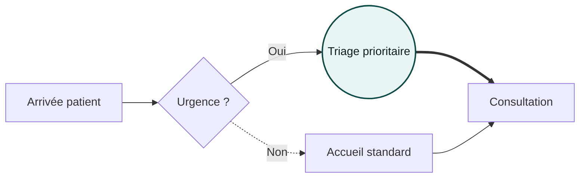

**Flèches rapides** : `-->` pleine · `-.->` pointillée · `==>` épaisse · `---` trait sans pointe
**Formes** : `[ ]` rectangle · `( )` arrondi · `(( ))` cercle · `{ }` décision · `[[ ]]` sous-routine · `[( )]` DB

---

### 2) Sequence (échanges)

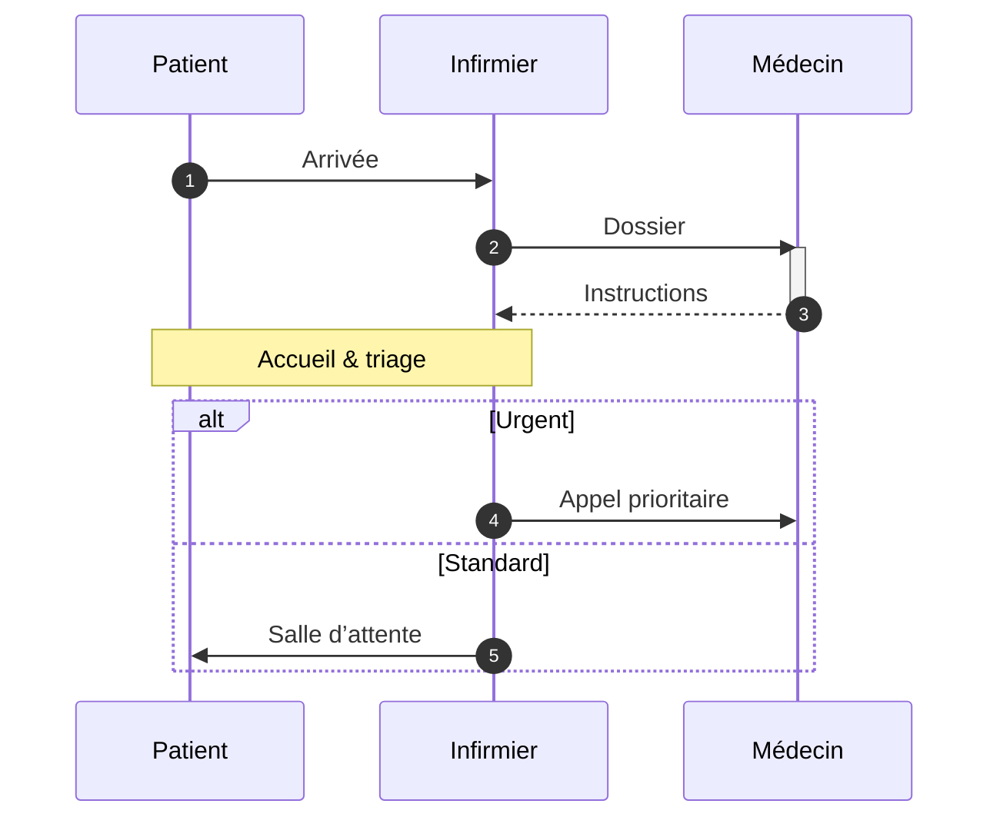

---

### 3) Class (modèle objet)

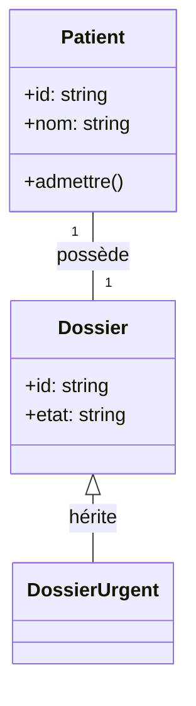

---

### 4) State (états)

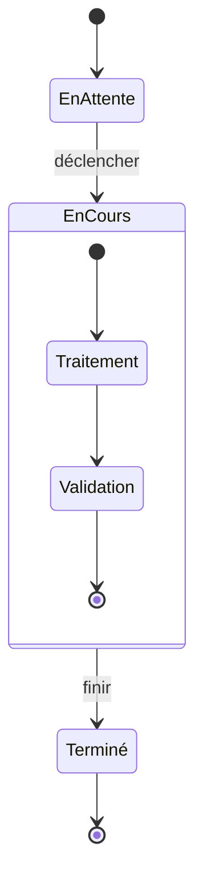

---

### 5) ER (entités / relations)

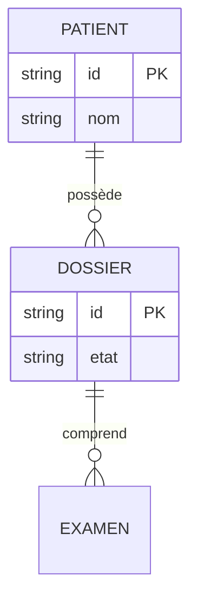

---

### 6) Gantt (planning)

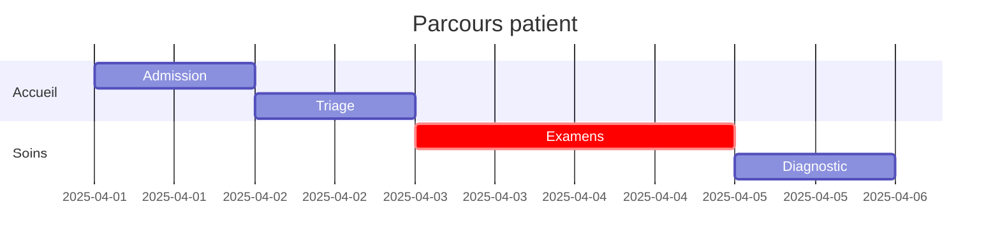

---

### 7) Pie (répartition)

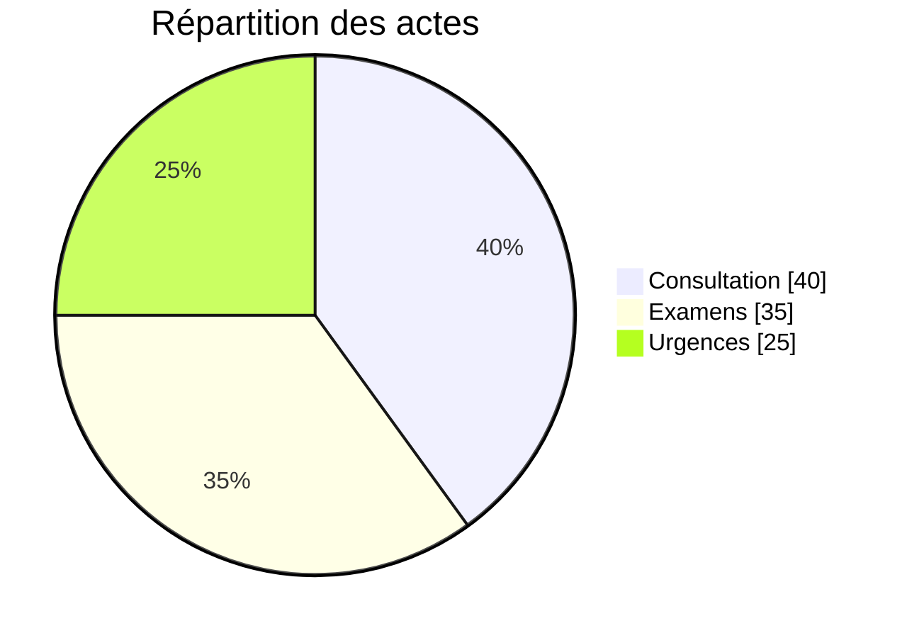

---

### 8) Journey (parcours UX)

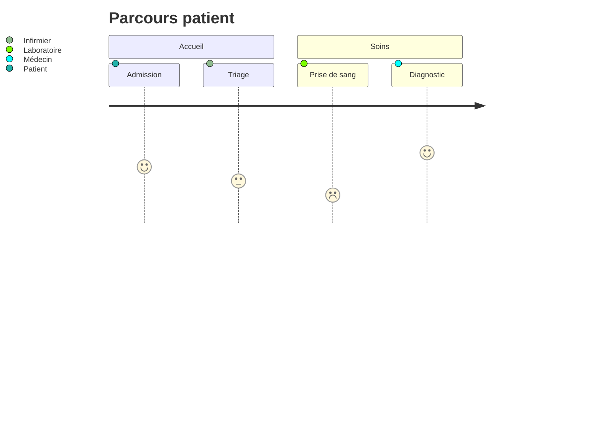

---

### 9) Timeline (chronologie)

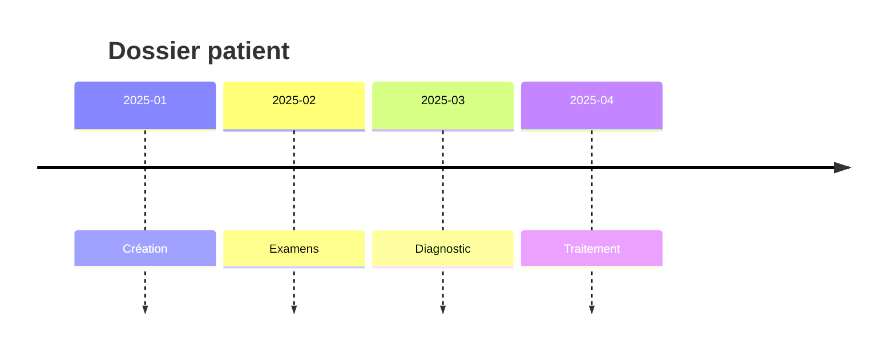

---

### 10) Mindmap (idées)

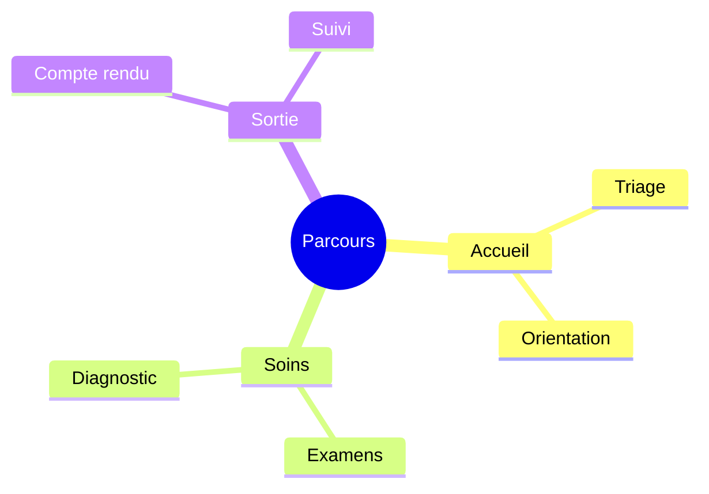

---

### 11) Git graph (workflows git)

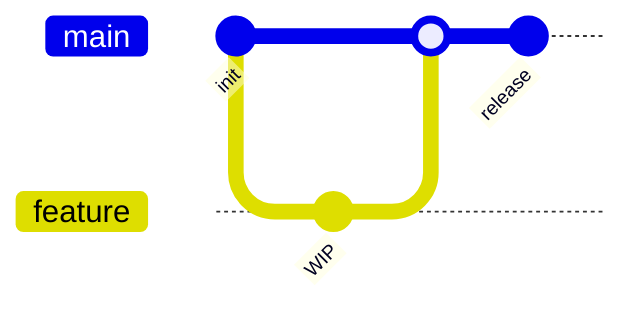

> \*Selon la version de Mermaid embarquée, d’autres types peuvent être dispos (p.ex. quadrantChart).

---

## 🖌️ Thèmes & personnalisation

* **Sélecteur de thème** : applique des palettes complètes (lignes **et** boîtes : nœuds, acteurs, clusters, notes) + **fond du canvas**.
* **Couleur** : tu peux surcharger la couleur principale des liens.
* **Police** : Inter, Work Sans, Manrope, Montserrat, JetBrains Mono (monospace).

Astuce : pour un rendu cohérent, pars d’un thème puis ajuste seulement la **couleur principale**.

---

## 📤 Exports

* **SVG** : vectoriel (impeccable pour Figma/Illustrator).
* **PNG** : bitmap **transparent** (présentations, web).
* **JPEG** : bitmap fond **blanc** (documents bureautiques).

> Les exports utilisent un pipeline **fiable** (SVG → Canvas → toBlob) pour éviter les soucis de polices et d’échelle.

---

## ⌨️ Raccourcis

* **Ctrl/Cmd + Entrée** : Générer depuis le prompt (si l'API est configurée)

---

## 🗺️ Architecture

### Stack technique

**Frontend**
- **Framework** : HTML + Alpine.js 3.x (réactivité légère)
- **Diagrammes** : Mermaid.js v10
- **Styles** : Tailwind CSS 3.x (CDN)
- **Éditeur** : ContentEditable natif avec toolbar personnalisée
- **Intégrations** : Web Speech API (dictée vocale française)
- **Exports** : SVG direct, PNG/JPEG via Canvas API

**Backend**
- **Framework** : Flask 3.0.3
- **PDF** : ReportLab 4.4+ (génération PDF professionnelle)
- **SVG** : svglib 1.6+ (conversion SVG → PDF vectoriel)
- **HTML** : BeautifulSoup4 + lxml (parsing HTML robuste)
- **API** : Endpoints REST pour Mistral AI
- **Stockage** : localStorage (navigateur) pour persistance locale

**Dépendances principales**
```txt
Flask==3.0.3
reportlab>=4.4.3
svglib>=1.6.0
beautifulsoup4>=4.12.0
lxml>=6.0.0
python-dotenv==1.0.1
requests==2.32.3
markdown==3.5.2
```

### Fonctionnalités techniques avancées

- **Conversion HTML → PDF** : Parser BeautifulSoup4 préservant gras, italique, listes, tableaux, code, citations
- **Intégration SVG vectorielle** : Conversion via svglib pour qualité optimale sans perte
- **Styles ReportLab personnalisés** : Chaque élément HTML (H1-H6, p, ul, ol, table, code) a son style dédié
- **Espacement intelligent** : Gestion automatique des sauts de ligne, paragraphes et espacements verticaux
- **KeepTogether** : Les titres d'images restent toujours avec leur image (pas de saut de page entre les deux)
- **Redimensionnement automatique** : Les images trop grandes sont réduites pour éviter les blancs
- **Footer sur toutes les pages** : Mentions légales et numérotation via `onFirstPage` et `onLaterPages`
- **Nettoyage Unicode** : Suppression automatique des caractères problématiques (carrés, espaces invisibles)
- **Historique persistant** : Sauvegarde automatique dans localStorage avec gestion complète (CRUD)

---

## 📄 Licence

MIT License - Copyright (c) 2025 Enovacom

---

## 🙌 Crédits

- **[Mermaid.js](https://mermaid.js.org/)** - Moteur de rendu de diagrammes
- **[Mistral AI](https://mistral.ai/)** - Intelligence artificielle pour génération
- **[ReportLab](https://www.reportlab.com/)** - Génération PDF professionnelle
- **[Alpine.js](https://alpinejs.dev/)** - Framework JavaScript léger
- **[Tailwind CSS](https://tailwindcss.com/)** - Framework CSS utilitaire

Développé avec ❤️ par l'équipe Enovacom
