# 🤖 Pathway From idea to diagram in seconds

Bienvenue dans **Pathway Editor**, un outil qui transforme en temps réel tes idées en **diagrammes intelligents** ✨  
Ici, tu n’as plus besoin d’écrire toi-même du code Mermaid : tu demandes à l’**IA** ce que tu veux (un organigramme, un Gantt, un mindmap, etc.), et le graphique est **généré instantanément** pour toi. 🚀

---

## 🧠 Ce que l’IA peut générer pour toi
En quelques secondes, tu peux obtenir :
- 🌀 **Flowcharts** – Processus, parcours utilisateurs, décisions
- 📊 **Gantt charts** – Plannings et roadmaps projet
- 🤝 **Sequence diagrams** – Interactions entre systèmes
- 🏷️ **Class & Entity diagrams** – UML et bases de données
- 🧠 **Mindmaps** – Brainstorming, organisation d’idées
- 📈 **State diagrams** – États d’un système
👉 Tu décris ton besoin avec une phrase simple, l’IA fait le reste.

---

## ⚡ Installation rapide

### Prérequis
- **Python 3.8+** : [Télécharger Python](https://www.python.org/downloads/)
  - ⚠️ **Important lors de l'installation** : Cochez la case **"Add Python to PATH"** !
- **Clé API Mistral AI** (personnelle) : [Obtenir une clé](https://console.mistral.ai)

### Installation Windows (automatique)

```bash
# 1. Cloner le repository
git clone https://github.com/enovacom/pathway.git
cd pathway

# 2. Double-cliquer sur start.bat (ou lancer en ligne de commande)
start.bat
```

**C'est tout !** Le script `start.bat` fait automatiquement :
- ✅ Création de l'environnement virtuel Python
- ✅ Installation des dépendances (Flask, requests, python-dotenv)
- ✅ Lancement de l'application
- ✅ Ouverture automatique dans votre navigateur

L'application s'ouvre sur `http://127.0.0.1:5173`

> 💡 **Astuce** : Si vous obtenez une erreur "Python n'est pas reconnu", c'est que Python n'est pas dans le PATH. Réinstallez Python en cochant "Add Python to PATH".

### Installation Linux/Mac

```bash
# Cloner le repository
git clone https://github.com/enovacom/pathway.git
cd pathway

# Lancer le script d'installation
chmod +x linux/start.sh
./linux/start.sh
```

Le script fait tout automatiquement (environnement virtuel, dépendances, lancement).

---

## 🧩 Types de diagrammes Mermaid supportés

Mermaid permet beaucoup de formats. Tu peux mixer les exemples ci-dessous directement dans l’app.

### 1) Flowchart (processus)

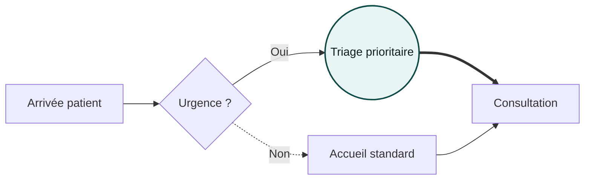

**Flèches rapides** : `-->` pleine · `-.->` pointillée · `==>` épaisse · `---` trait sans pointe
**Formes** : `[ ]` rectangle · `( )` arrondi · `(( ))` cercle · `{ }` décision · `[[ ]]` sous-routine · `[( )]` DB

---

### 2) Sequence (échanges)

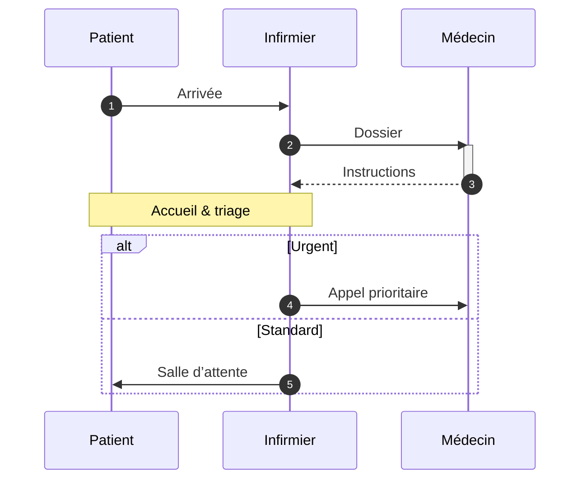

---

### 3) Class (modèle objet)

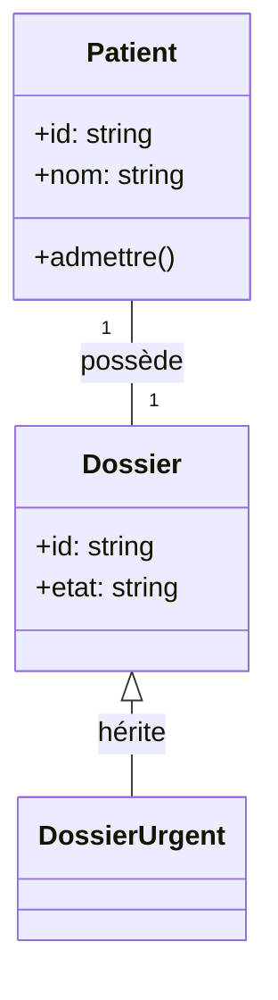

---

### 4) State (états)

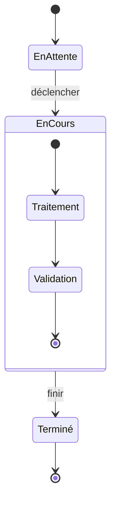

---

### 5) ER (entités / relations)

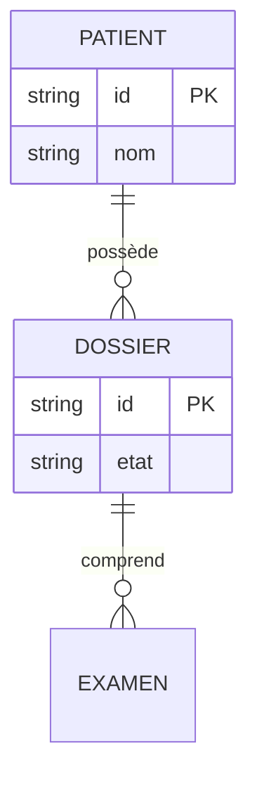

---

### 6) Gantt (planning)

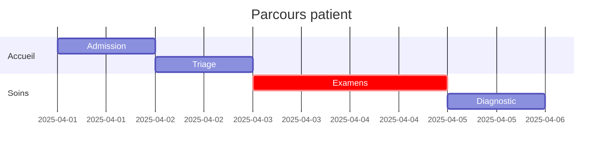

---

### 7) Pie (répartition)

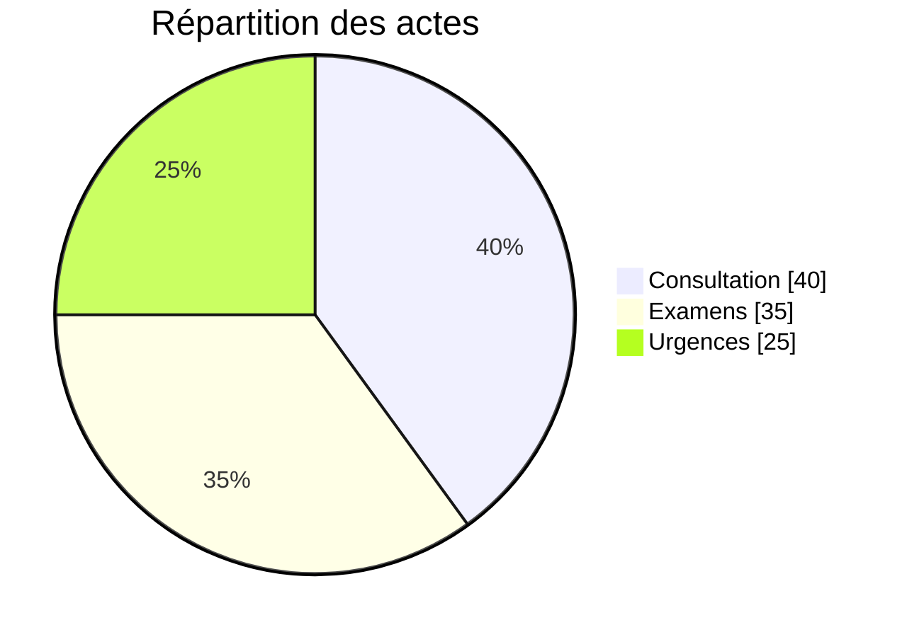

---

### 8) Journey (parcours UX)

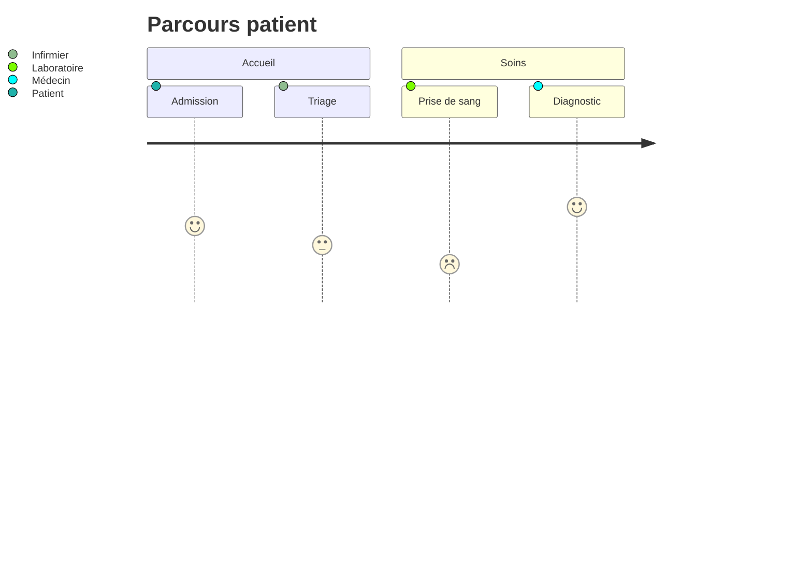

---

### 9) Timeline (chronologie)

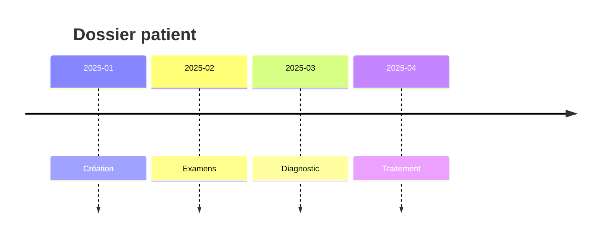

---

### 10) Mindmap (idées)

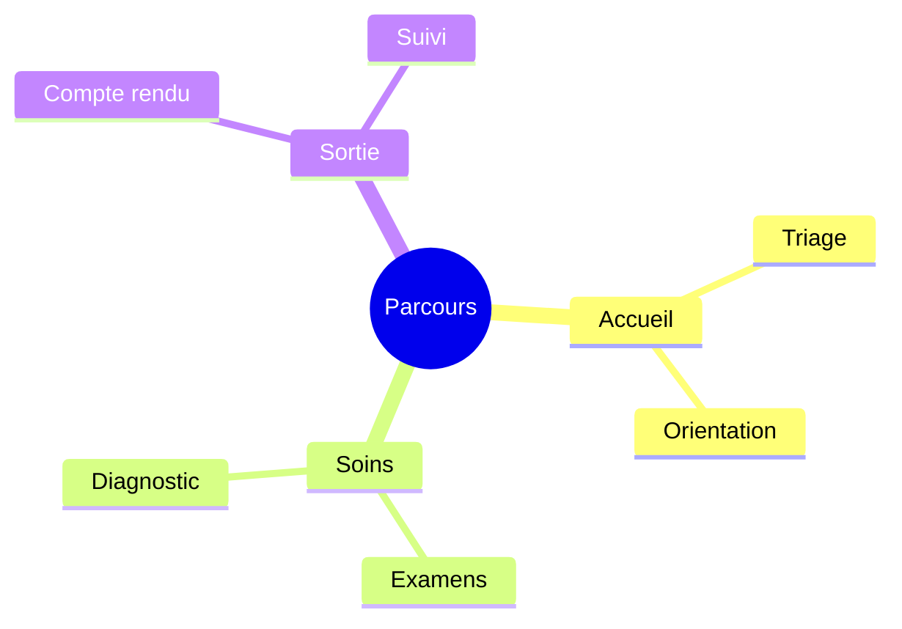

---

### 11) Git graph (workflows git)

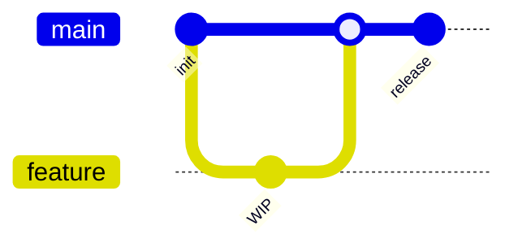

> \*Selon la version de Mermaid embarquée, d’autres types peuvent être dispos (p.ex. quadrantChart).

---

## 🖌️ Thèmes & personnalisation

* **Sélecteur de thème** : applique des palettes complètes (lignes **et** boîtes : nœuds, acteurs, clusters, notes) + **fond du canvas**.
* **Couleur** : tu peux surcharger la couleur principale des liens.
* **Police** : Inter, Work Sans, Manrope, Montserrat, JetBrains Mono (monospace).

Astuce : pour un rendu cohérent, pars d’un thème puis ajuste seulement la **couleur principale**.

---

## 📤 Exports

* **SVG** : vectoriel (impeccable pour Figma/Illustrator).
* **PNG** : bitmap **transparent** (présentations, web).
* **JPEG** : bitmap fond **blanc** (documents bureautiques).

> Les exports utilisent un pipeline **fiable** (SVG → Canvas → toBlob) pour éviter les soucis de polices et d’échelle.

---

## ⌨️ Raccourcis

* **Ctrl/Cmd + Entrée** : Générer depuis le prompt (si l’API est configurée).

---

## 🧪 Démo rapide (copier/coller)

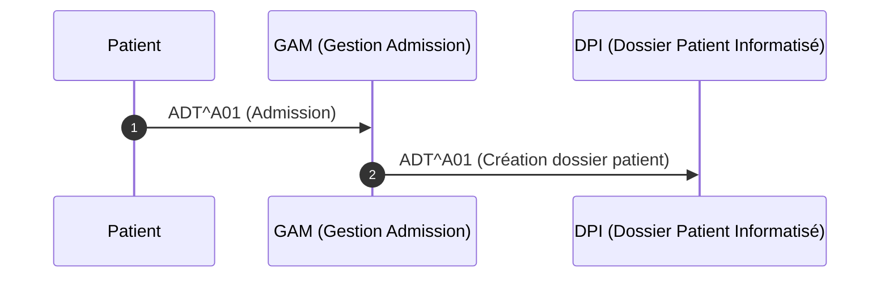

---

## 🗺️ Architecture (très simple)

* **Frontend** : HTML + Alpine.js + Mermaid v10 + Tailwind (CDN pour dev).
* **Intégrations** : Web Speech API (dictée FR).
* **Exports** : SVG direct, PNG/JPEG via Canvas `toBlob`.
* **Backend (optionnel)** : endpoints REST minces pour parler à l’API Mistral.

---

## 📌 Roadmap (idées)

* Palette **brand-lock** (verrouiller la couleur pour certains thèmes).
* **Templates** réutilisables (snippets Mermaid prêts à l’emploi).
* **Historique**/versions du code Mermaid.
* **Import .mmd** (glisser-déposer).

---

## 🤝 Contribuer

PR bienvenues ! Style code : clair, minimal, compos discret.
Design : sobre, “2025”, accessible (contrastes et tailles lisibles).

---

## 📄 Licence

MIT — fais-toi plaisir ✌️

---

## 🙌 Crédits

* [Mermaid](https://mermaid.js.org/) pour le moteur de rendu
* Merci à toutes les personnes qui aiment les jolis schémas ❤️

```
```
