# 🤖 Pathway From idea to diagram in seconds

Bienvenue dans **Pathway Editor**, un outil qui transforme en temps réel tes idées en **diagrammes intelligents** ✨  
Ici, tu n’as plus besoin d’écrire toi-même du code Mermaid : tu demandes à l’**IA** ce que tu veux (un organigramme, un Gantt, un mindmap, etc.), et le graphique est **généré instantanément** pour toi. 🚀

---

## 🧠 Ce que l’IA peut générer pour toi
En quelques secondes, tu peux obtenir :
- 🌀 **Flowcharts** – Processus, parcours utilisateurs, décisions
- 📊 **Gantt charts** – Plannings et roadmaps projet
- 🤝 **Sequence diagrams** – Interactions entre systèmes
- 🏷️ **Class & Entity diagrams** – UML et bases de données
- 🧠 **Mindmaps** – Brainstorming, organisation d’idées
- 📈 **State diagrams** – États d’un système
- 🎨 Et tout autre diagramme pris en charge par [Mermaid.js](https://mermaid.js.org/)

👉 Tu décris ton besoin avec une phrase simple, l’IA fait le reste.

---

## ⚡ Installation en 2 minutes
Clone le repo (ou télécharge en ZIP) :

```bash
git clone https://github.com/svoer/pathway.git
cd pathway


---

## ✨ Ce que tu peux faire
- **Générer** du Mermaid depuis un prompt (via API Mistral) ou écrire à la main.
- **Prévisualiser** en direct le rendu.
- **Thèmes** (15+ palettes) qui recolorisent **lignes, boîtes, acteurs, clusters, notes** et le **fond**.
- **Personnaliser** la couleur principale & la police (Inter, Work Sans, Manrope, Montserrat, JetBrains Mono…).
- **Dicter** ton prompt (Web Speech API, FR).
- **Exporter** en **SVG** (vectoriel), **PNG** (fond transparent), **JPEG** (fond blanc).

> ⚠️ Par design, l’export **.mmd** n’est pas exposé dans l’UI (on garde le focus sur les rendus finaux).

---

## 🧩 Types de diagrammes Mermaid supportés
Mermaid permet beaucoup de formats. Tu peux mixer les exemples ci-dessous directement dans l’app.

### 1) Flowchart (processus)
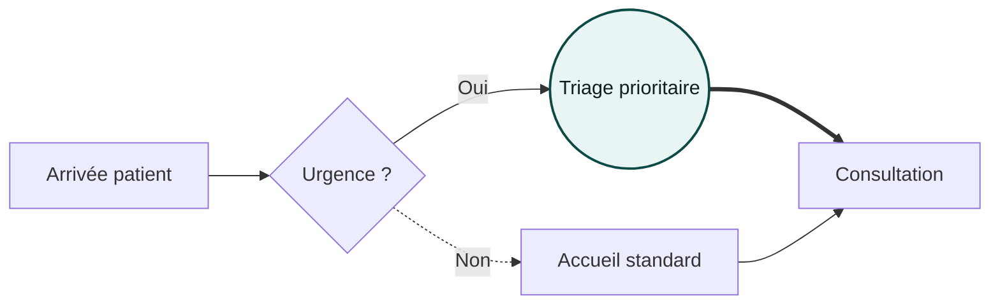
**Flèches rapides** : `-->` pleine · `-.->` pointillée · `==>` épaisse · `---` trait sans pointe  
**Formes** : `[ ]` rectangle · `( )` arrondi · `(( ))` cercle · `{ }` décision · `[[ ]]` sous-routine · `[( )]` DB

---

### 2) Sequence (échanges)
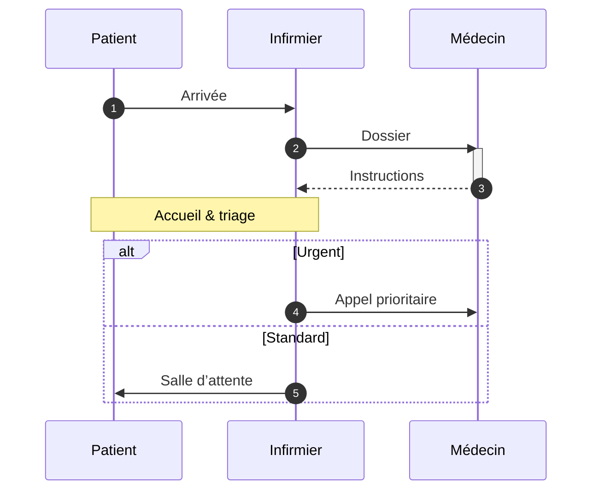

---

### 3) Class (modèle objet)
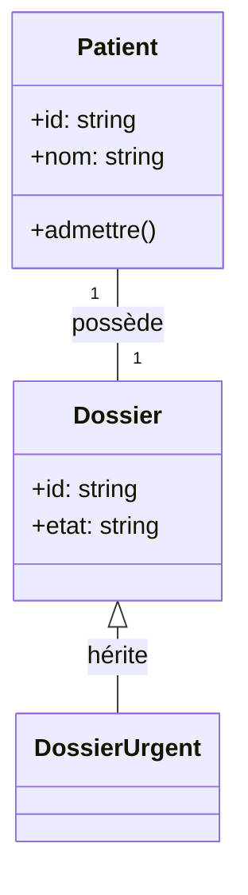

---

### 4) State (états)
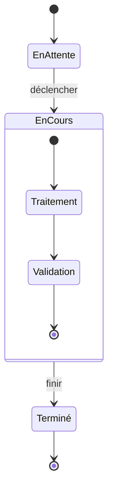

---

### 5) ER (entités / relations)
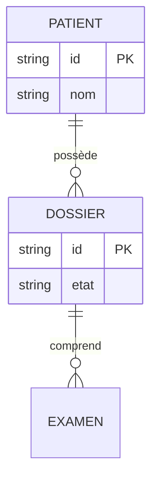

---

### 6) Gantt (planning)
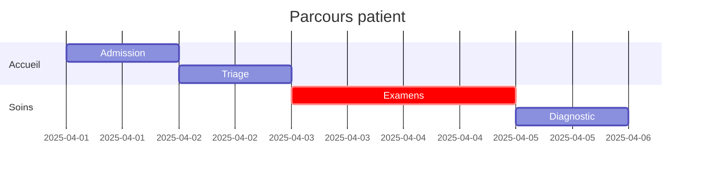

---

### 7) Pie (répartition)
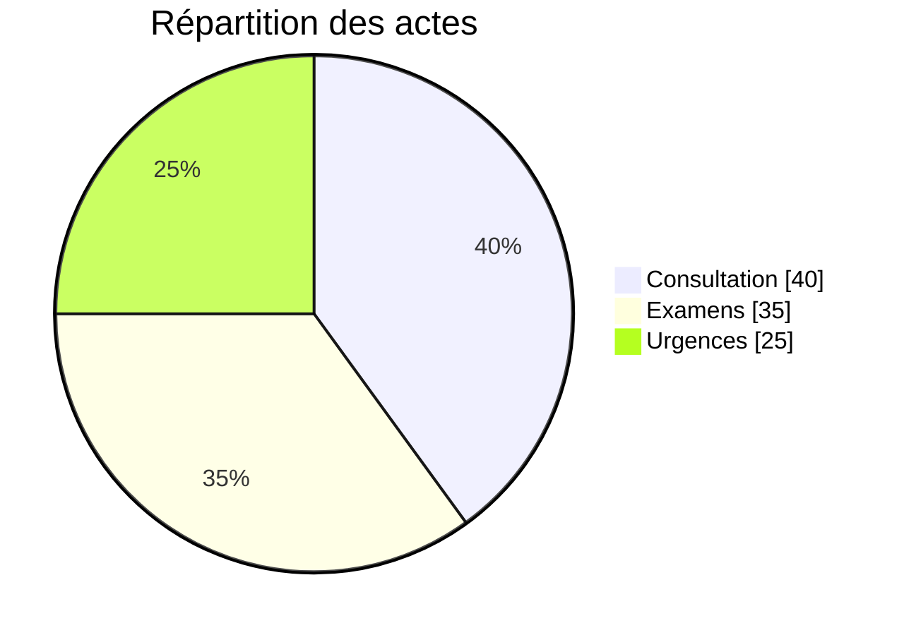

---

### 8) Journey (parcours UX)
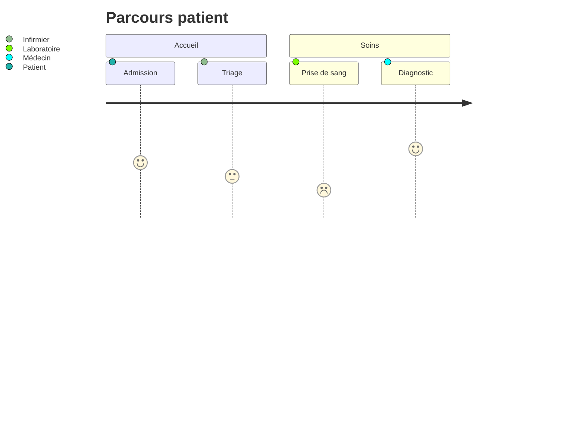

---

### 9) Timeline (chronologie)
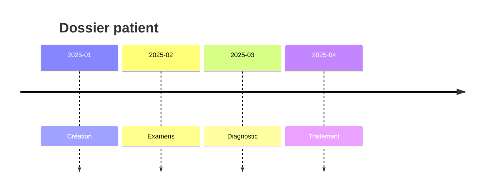

---

### 10) Mindmap (idées)
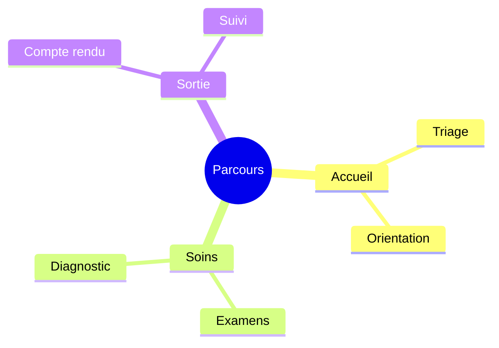

---

### 11) Git graph (workflows git)
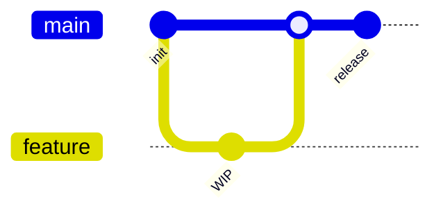

> *Selon la version de Mermaid embarquée, d’autres types peuvent être dispos (p.ex. quadrantChart).

---

## 🖌️ Thèmes & personnalisation
- **Sélecteur de thème** : applique des palettes complètes (lignes **et** boîtes : nœuds, acteurs, clusters, notes) + **fond du canvas**.
- **Couleur** : tu peux surcharger la couleur principale des liens.
- **Police** : Inter, Work Sans, Manrope, Montserrat, JetBrains Mono (monospace).

Astuce : pour un rendu cohérent, pars d’un thème puis ajuste seulement la **couleur principale**.

---

## 📤 Exports
- **SVG** : vectoriel (impeccable pour Figma/Illustrator).
- **PNG** : bitmap **transparent** (présentations, web).
- **JPEG** : bitmap fond **blanc** (documents bureautiques).

> Les exports utilisent un pipeline **fiable** (SVG → Canvas → toBlob) pour éviter les soucis de polices et d’échelle.

---

## ⌨️ Raccourcis
- **Ctrl/Cmd + Entrée** : Générer depuis le prompt (si l’API est configurée).

---

## 🏗️ Démarrage rapide
1. Clone le repo et ouvre **`index.html`** dans ton navigateur.  
   > 💡 Pour éviter les restrictions CORS locales, lance un mini serveur :  
   > `python3 -m http.server 8080` puis va sur `http://localhost:8080`.
2. (Optionnel) Configure l’API Mistral pour la génération automatique :
   - UI : bouton **Paramètres** → saisis **Base URL** et **API Key**.
   - **Backend attendu** (à implémenter côté serveur) :
     - `GET /api/mistral/models` → liste des modèles
     - `POST /api/settings/mistral` → stocke base_url/api_key
     - `POST /api/generate` → `{ prompt, model } → { mermaid }`
3. Tape/colle du **Mermaid** → choisis un **thème** → **Export** en 1 clic.

> ⚠️ En production, installe **Tailwind** en **PostCSS/CLI** (évite le CDN).

---

## 🧪 Démo rapide (copier/coller)
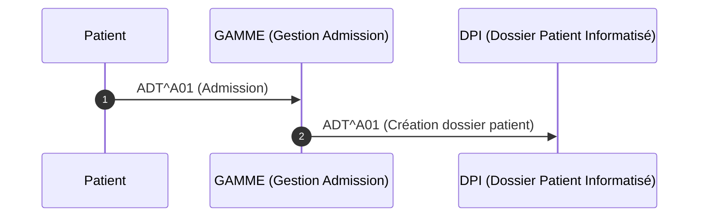

---

## 🗺️ Architecture (très simple)
- **Frontend** : HTML + Alpine.js + Mermaid v10 + Tailwind (CDN pour dev).
- **Intégrations** : Web Speech API (dictée FR).
- **Exports** : SVG direct, PNG/JPEG via Canvas `toBlob`.
- **Backend (optionnel)** : endpoints REST minces pour parler à l’API Mistral.

---

## 📌 Roadmap (idées)
- Palette **brand-lock** (verrouiller la couleur pour certains thèmes).
- **Templates** réutilisables (snippets Mermaid prêts à l’emploi).
- **Historique**/versions du code Mermaid.
- **Import .mmd** (glisser-déposer).

---

## 🤝 Contribuer
PR bienvenues ! Style code : clair, minimal, compos discret.  
Design : sobre, “2025”, accessible (contrastes et tailles lisibles).

---

## 📄 Licence
MIT — fais-toi plaisir ✌️

---

## 🙌 Crédits
- [Mermaid](https://mermaid.js.org/) pour le moteur de rendu
- Merci à toutes les personnes qui aiment les jolis schémas ❤️
