# Enovacom Pathway

**Application web interne** pour la création de diagrammes professionnels par intelligence artificielle.

> **From idea to diagram in seconds**

## Présentation

**Enovacom Pathway** est une application web développée en interne pour les collaborateurs Enovacom. Elle permet de générer automatiquement des diagrammes professionnels (Mermaid.js) à partir de descriptions en langage naturel, grâce à l'intelligence artificielle Mistral AI.

### Cas d'usage
- **Architecture technique** : Diagrammes de séquence, diagrammes de classes
- **Processus métier** : Flowcharts, diagrammes d'états
- **Gestion de projet** : Gantt, timelines
- **Documentation** : Diagrammes ER, mindmaps
- **Présentations clients** : Tous types de diagrammes personnalisables

### Avantages
- ✅ **Gain de temps** : Génération instantanée par IA
- ✅ **Qualité professionnelle** : 30+ thèmes, export haute qualité
- ✅ **Simplicité** : Pas besoin de connaître la syntaxe Mermaid
- ✅ **Personnalisation** : Couleurs, polices, styles entièrement configurables
- ✅ **Sécurité** : Données stockées localement, aucun serveur central

---

## ⚡ Installation

### Prérequis

#### 1. Python 3.8+
- **Télécharger** : [python.org/downloads](https://www.python.org/downloads/)
- ⚠️ **Important** : Lors de l'installation, cochez la case **"Add Python to PATH"**

#### 2. Clé API Mistral AI (gratuite)

**Mistral AI offre un test d'API gratuit** pour tester l'API, suffisant pour générer des centaines de diagrammes.

**Étapes pour créer votre compte gratuit :**

1. **Créer un compte** : Rendez-vous sur [console.mistral.ai](https://console.mistral.ai)
2. **S'inscrire** : Utilisez votre email professionnel Enovacom
3. **Vérifier votre email** : Cliquez sur le lien de confirmation
4. **Accéder à la console** : Connectez-vous à [console.mistral.ai](https://console.mistral.ai)
5. **Créer une clé API** :
   - Cliquez sur **"API Keys"** dans le menu
   - Cliquez sur **"Create new key"**
   - Donnez un nom à votre clé (ex: "Enovacom Pathway")
   - Copiez la clé générée (elle ne sera affichée qu'une seule fois !)
6. **Conserver votre clé** : Sauvegardez-la dans un endroit sûr

> 💡 **Astuce** : Les 5€ gratuits permettent environ 500 générations de diagrammes. Au-delà, vous pouvez ajouter des crédits selon vos besoins (tarifs très compétitifs).

> 🔒 **Sécurité** : Votre clé API est stockée uniquement dans le localStorage de votre navigateur. Elle n'est jamais transmise aux serveurs Enovacom.

### Installation Windows (automatique)

```bash
# 1. Cloner le repository
git clone https://github.com/enovacom/pathway.git
cd pathway

# 2. Double-cliquer sur start.bat (ou lancer en ligne de commande)
start.bat
```

**C'est tout !** Le script `start.bat` fait automatiquement :
- ✅ Création de l'environnement virtuel Python
- ✅ Installation des dépendances (Flask, requests, python-dotenv)
- ✅ Lancement de l'application
- ✅ Ouverture automatique dans votre navigateur

L'application s'ouvre sur `http://127.0.0.1:5173`

> 💡 **Astuce** : Si vous obtenez une erreur "Python n'est pas reconnu", c'est que Python n'est pas dans le PATH. Réinstallez Python en cochant "Add Python to PATH".

### Installation Linux/Mac

```bash
# Cloner le repository
git clone https://github.com/enovacom/pathway.git
cd pathway

# Lancer le script d'installation
chmod +x linux/start.sh
./linux/start.sh
```

Le script fait tout automatiquement (environnement virtuel, dépendances, lancement).

---

## 🔧 Configuration

### Première utilisation

Lors du premier lancement de l'application :

1. **Ouvrir l'application** : L'application s'ouvre automatiquement sur `http://127.0.0.1:5173`
2. **Cliquer sur "Paramètres"** : Bouton dans le header de l'application
3. **Configurer Mistral AI** :
   - **Base URL** : Laisser `https://api.mistral.ai` (par défaut)
   - **API Key** : Coller votre clé API Mistral créée précédemment
4. **Tester la connexion** : Cliquez sur "Tester" pour vérifier que tout fonctionne
5. **Sauvegarder** : Cliquez sur "Sauvegarder" pour enregistrer vos paramètres

✅ **C'est prêt !** Vous pouvez maintenant générer des diagrammes par IA.

### Sélection du modèle

L'application charge automatiquement la liste des modèles Mistral AI disponibles. Nous recommandons :

- **`mistral-large-latest`** : Le plus puissant, meilleure qualité de génération
- **`mistral-medium-latest`** : Bon équilibre qualité/coût
- **`mistral-small-latest`** : Rapide et économique pour tests

> 💡 **Conseil** : Commencez avec `mistral-small-latest` pour tester, puis passez à `mistral-large-latest` pour la production.

---

## 🧩 Types de diagrammes Mermaid supportés

Mermaid permet beaucoup de formats. Tu peux mixer les exemples ci-dessous directement dans l’app.

### 1) Flowchart (processus)

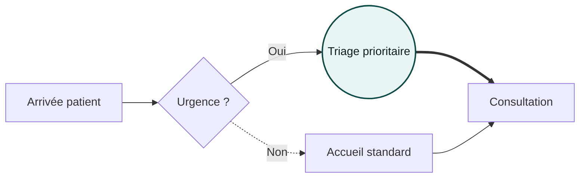

**Flèches rapides** : `-->` pleine · `-.->` pointillée · `==>` épaisse · `---` trait sans pointe
**Formes** : `[ ]` rectangle · `( )` arrondi · `(( ))` cercle · `{ }` décision · `[[ ]]` sous-routine · `[( )]` DB

---

### 2) Sequence (échanges)

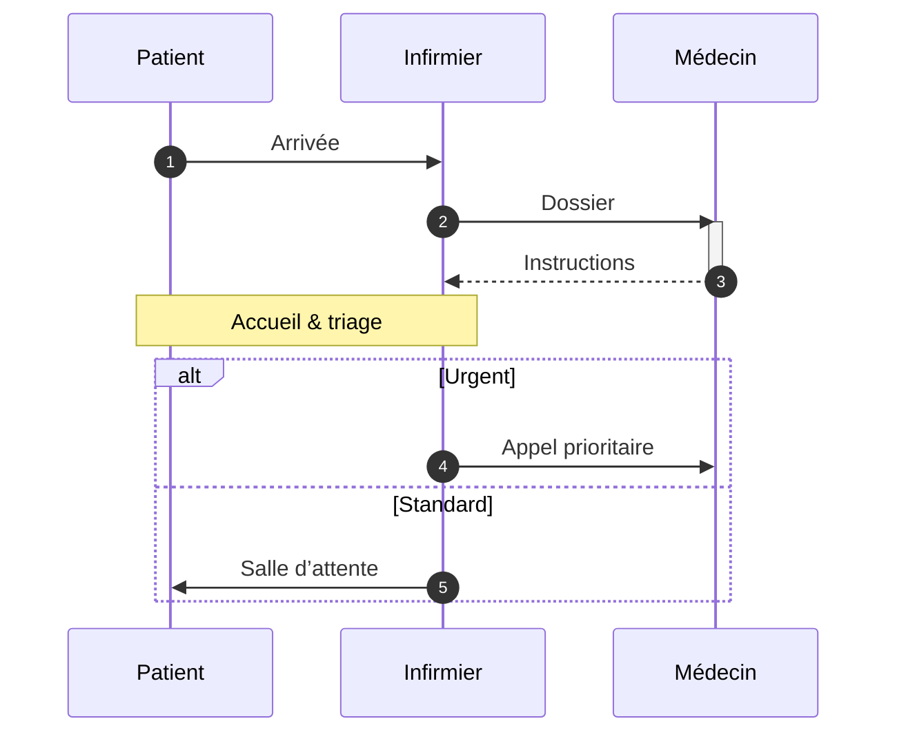

---

### 3) Class (modèle objet)

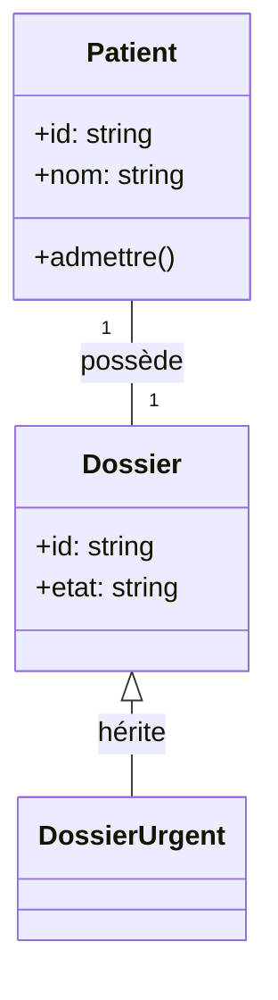

---

### 4) State (états)

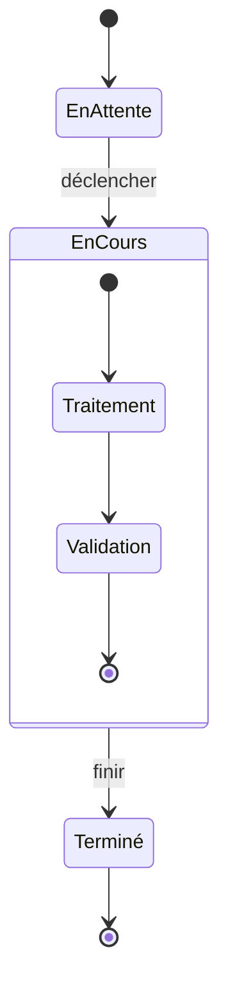

---

### 5) ER (entités / relations)

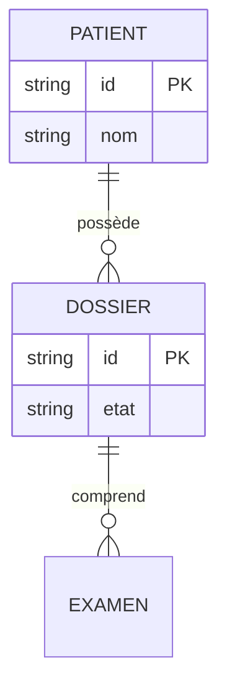

---

### 6) Gantt (planning)

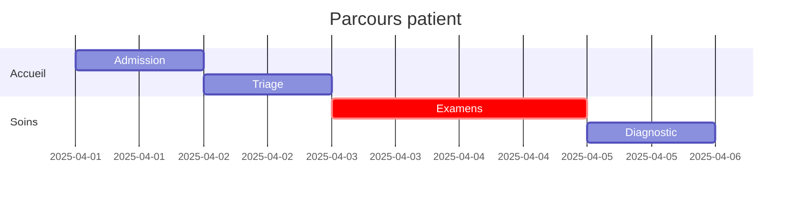

---

### 7) Pie (répartition)

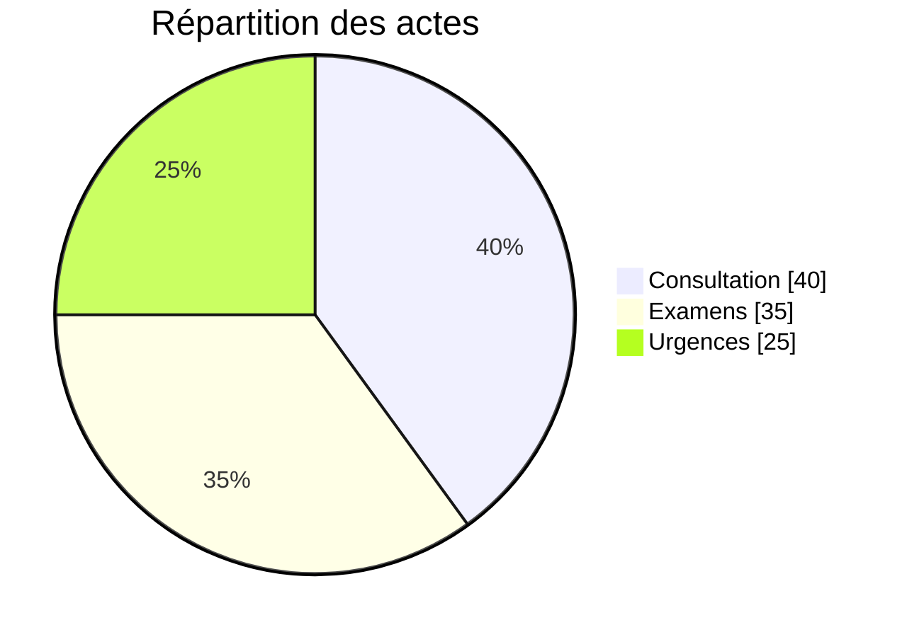

---

### 8) Journey (parcours UX)

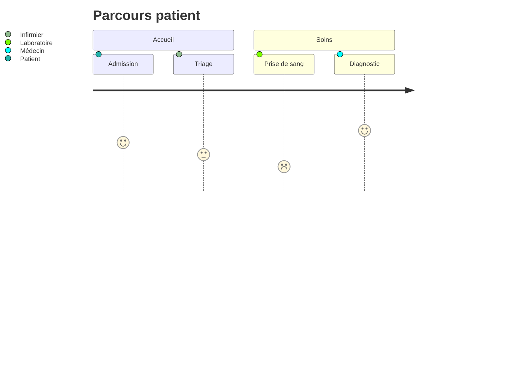

---

### 9) Timeline (chronologie)

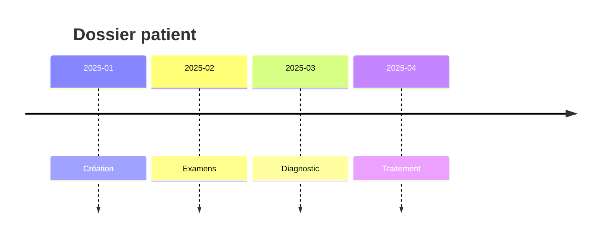

---

### 10) Mindmap (idées)

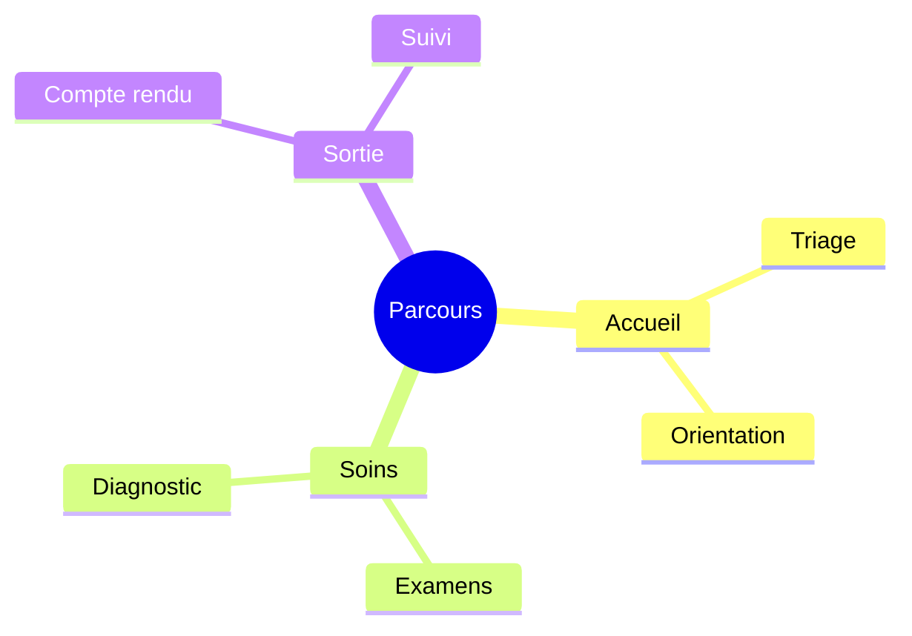

---

### 11) Git graph (workflows git)

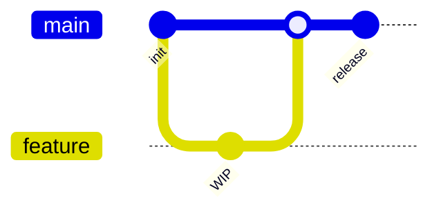

> \*Selon la version de Mermaid embarquée, d’autres types peuvent être dispos (p.ex. quadrantChart).

---

## 🖌️ Thèmes & personnalisation

* **Sélecteur de thème** : applique des palettes complètes (lignes **et** boîtes : nœuds, acteurs, clusters, notes) + **fond du canvas**.
* **Couleur** : tu peux surcharger la couleur principale des liens.
* **Police** : Inter, Work Sans, Manrope, Montserrat, JetBrains Mono (monospace).

Astuce : pour un rendu cohérent, pars d’un thème puis ajuste seulement la **couleur principale**.

---

## 📤 Exports

* **SVG** : vectoriel (impeccable pour Figma/Illustrator).
* **PNG** : bitmap **transparent** (présentations, web).
* **JPEG** : bitmap fond **blanc** (documents bureautiques).

> Les exports utilisent un pipeline **fiable** (SVG → Canvas → toBlob) pour éviter les soucis de polices et d’échelle.

---

## ⌨️ Raccourcis

* **Ctrl/Cmd + Entrée** : Générer depuis le prompt (si l’API est configurée).

---

## 🗺️ Architecture (très simple)

* **Frontend** : HTML + Alpine.js + Mermaid v10 + Tailwind (CDN pour dev).
* **Intégrations** : Web Speech API (dictée FR).
* **Exports** : SVG direct, PNG/JPEG via Canvas `toBlob`.
* **Backend (optionnel)** : endpoints REST minces pour parler à l’API Mistral.

## 📄 Licence

MIT

---

## 🙌 Crédits

* [Mermaid](https://mermaid.js.org/) pour le moteur de rendu
* Merci à toutes les personnes qui aiment les jolis schémas ❤️

```
```
